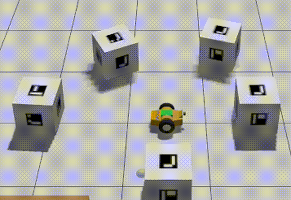

# ExpRob– Assignment 1
Aruco Scanner Node (ROS2)

Authors: Ahmed_Salah-Maze_Atta-Mohamed_Ismail

Course: Experimental Robotics Laboratorty-University of Genoa

---

## Overview
This repository contains the solution for ExpRob – Assignment 1.

Goal: autonomously detect ArUco markers in a simulated Gazebo environment, approach them one by one, and return to the starting (HOME) position after each visit.

The core logic is implemented in a custom ROS 2 node `aruco_scanner_node`, which uses a finite-state machine to control the robot behavior.

---

## System Behavior (State Machine)
The robot operates according to these states:

- INIT_HOME
  - Waits for the first `/odometry/filtered` message
  - Stores the HOME pose
- SCANNING
  - Rotates in place
  - Detects ArUco markers using `aruco_opencv`
  - Confirms markers only after continuous detection
- CENTERING
  - Rotates until the selected marker is centered in the camera image
- APPROACHING
  - Moves forward until a distance threshold from the marker is reached
- HOME
  - Returns to the HOME position
  - Selects the next unvisited marker
- DONE
  - Stops once all markers have been visited

Markers are processed in ascending order of their IDs.

---

## Demo

### Robot Camera View (POV)


### Third-Person View (Gazebo)


📹 **Full-resolution videos:**  
https://drive.google.com/drive/folders/1CValVfP6zW1D-L1NEGznBjSKgR2_Ptp-

## Environment Setup

1. Gazebo Models

Place the following models in:
`/home/ubuntu/gazebo_models`

Required folders:
- `aruco_box`
- `aws_robomaker_warehouse_ClutteringC_01`
- `brick_box_3x1x3`
- `LitterBin`

Note: One model may be missing - comment it out in the world file if necessary.

2. Launch Test Environment

Run:
```bash
ros2 launch bme_gazebo_sensors spawn_robot.launch.py \
  world:=my_world.sdf \
  rviz_config:=gps.rviz \
  x:=2.0 y:=-0.5 z:=0
```

3. EKF Configuration

In `ekf.yaml`, comment the last line (if required by your setup).

4. Camera Configuration

In `mogibot.gazebo`, replace the camera section with:
```xml
<gazebo reference="camera_link">
  <sensor name="camera" type="camera">
    <camera>
      <horizontal_fov>1.3962634</horizontal_fov>
      <image>
        <width>640</width>
        <height>480</height>
        <format>R8G8B8</format>
      </image>
      <clip>
        <near>0.1</near>
        <far>15</far>
      </clip>
      <noise>
        <type>gaussian</type>
        <mean>0.0</mean>
        <stddev>0.007</stddev>
      </noise>
      <optical_frame_id>camera_link_optical</optical_frame_id>
      <camera_info_topic>camera/camera_info</camera_info_topic>
    </camera>
    <always_on>1</always_on>
    <update_rate>20</update_rate>
    <visualize>true</visualize>
    <topic>camera/image</topic>
  </sensor>
</gazebo>
```

5. ArUco Tracker Configuration

In `aruco_tracker.yaml`:
```yaml
cam_base_topic: /camera/image
marker_dict: ARUCO_ORIGINAL
```

---

## Running the System

1. Start the world:
```bash
ros2 launch bme_gazebo_sensors spawn_robot.launch.py \
  world:=aruco_world.sdf \
  rviz_config:=gps.rviz \
  x:=2.0 y:=-0.5 z:=0
```

2. Run the ArUco detector:
```bash
ros2 launch aruco_opencv aruco_tracker.launch.xml
```

3. Run the scanner node:
```bash
ros2 run aruco_scanner aruco_scanner_node
```

---

## Known Issues
- OpenCV version:
  - OpenCV ≥ 4.7 may cause `setSize` or large allocation errors.
  - Recommended: OpenCV 4.6.x or lower.

---

## Documentation
Sphinx documentation is available in the `docs/` folder.

To build locally:
```bash
cd docs
make html
```

The generated documentation describes:
- Node architecture
- State machine
- ROS interfaces
- Parameters and callbacks